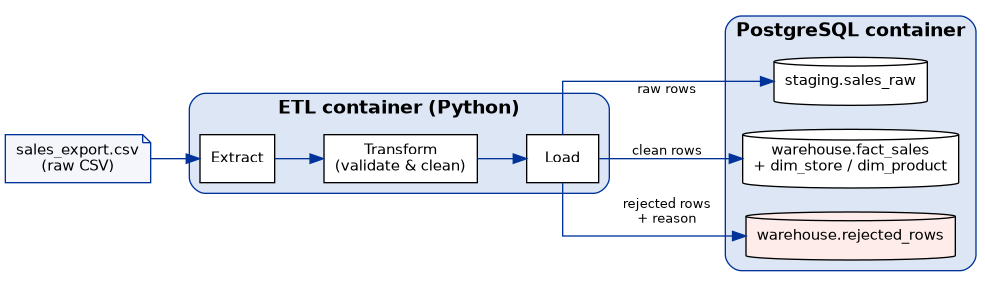
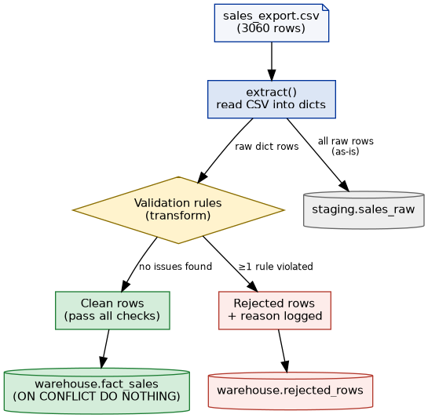
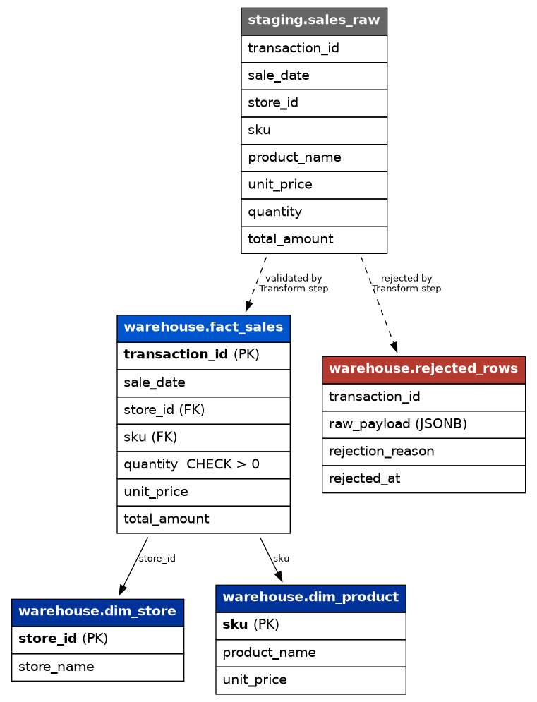
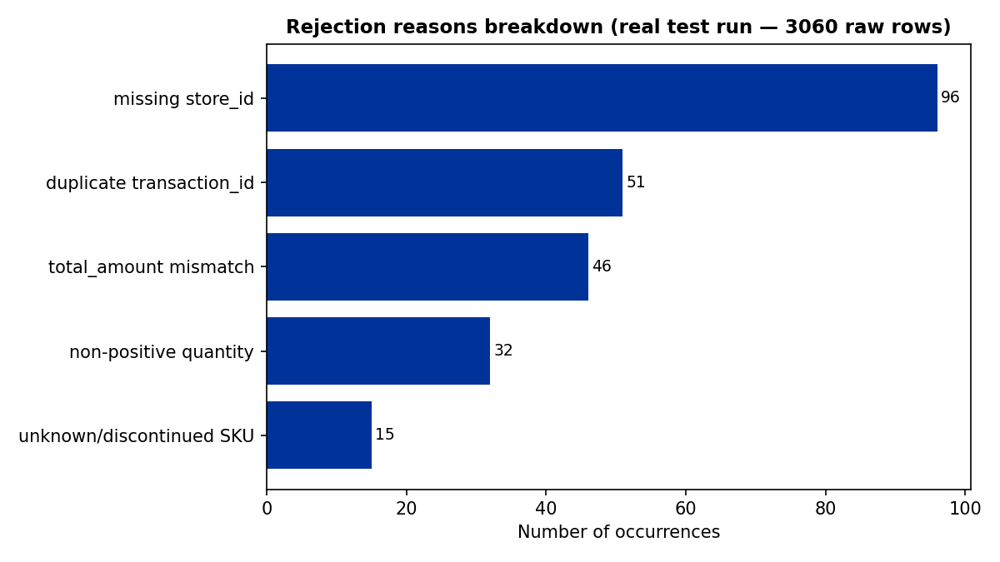
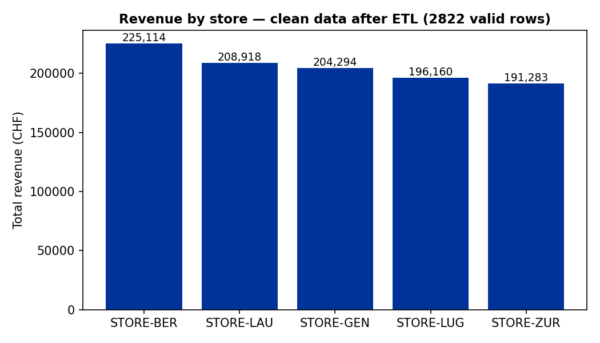

# ETL Pipeline — Docker + PostgreSQL

A containerized **Extract-Transform-Load** pipeline that ingests a raw daily
sales export (CSV), validates and cleans it, and loads it into a
**PostgreSQL** data warehouse using a simple star-schema model — all
orchestrated with **Docker Compose**.

This project illustrates a core DataOps skill set: building a reproducible,
containerized ETL/ELT flow with proper data validation, auditability of
rejected records, and a dimensional warehouse model, rather than a one-off
script.

## Architecture



Two Docker services, defined in `docker-compose.yml`:

- **`postgres`** — PostgreSQL 16, schema auto-initialized on first boot via
  `sql/init_schema.sql` (mounted into `/docker-entrypoint-initdb.d`, which
  Postgres runs automatically the first time the container starts with an
  empty data volume).
- **`etl`** — a Python container that waits for `postgres` to report healthy
  (via `depends_on: condition: service_healthy`), then runs the pipeline
  once (extract → transform → load) and exits. It's a job, not a
  long-running service.

## How the ETL pipeline actually works



The pipeline lives in `etl/etl_pipeline.py` and is split into three clearly
separated functions — this separation matters because each stage can be
tested, debugged, or re-run independently.

### 1. Extract (`extract()`)

Reads the raw CSV file (`data/raw/sales_export.csv`) with Python's built-in
`csv.DictReader`, so every row comes back as a dictionary keyed by column
name (`transaction_id`, `sale_date`, `store_id`, `sku`, `product_name`,
`unit_price`, `quantity`, `total_amount`). No parsing or validation happens
here — the goal is just to get the raw data into memory, exactly as it
exists in the source file, including all its messiness.

### 2. Transform (`transform()`)

This is where the actual data quality logic lives. For every row, it runs a
series of checks and collects a list of `reasons` if anything is wrong. A
row is only accepted if the list of reasons is empty. Concretely, the
function:

- **Parses dates in two possible formats** (`parse_date()` tries
  `YYYY-MM-DD` first, then `DD/MM/YYYY`) — because the source system in
  this scenario exports dates inconsistently, which is a very common
  real-world data quality issue.
- **Tracks seen `transaction_id`s in a Python `set`** to catch duplicates in
  a single pass, without needing a second loop or a database round-trip.
- **Casts `unit_price`, `quantity`, and `total_amount` to numeric types**
  inside `try/except` blocks — if the cast fails (e.g. the field is empty
  or contains text), the row is flagged rather than crashing the whole
  pipeline.
- **Recomputes the expected total** (`unit_price × quantity`) and compares
  it to the `total_amount` column from the source file, flagging anything
  off by more than 5 cents (a small tolerance for floating-point rounding).
  This catches a whole class of upstream data entry errors that a naive
  "just load what's there" pipeline would miss.
- **Flags known-bad SKUs** (`SKU-9999`, standing in for a discontinued or
  unrecognized product code in this scenario).

Every rejected row keeps its **original raw payload** plus the **exact
reason(s)** it failed — nothing is silently dropped. This is the difference
between a pipeline you can debug and one where "some rows just went
missing" becomes a support ticket six months later.

### 3. Load (`load()`)

Opens a single `psycopg2` connection and, inside one transaction:

1. Bulk-inserts **all raw rows** (valid or not) into `staging.sales_raw`
   using `execute_values` (much faster than one `INSERT` per row) — this
   keeps a full audit trail of exactly what the source system sent, even
   for rows that get rejected downstream.
2. **Upserts** the distinct stores and products seen in the clean rows into
   `warehouse.dim_store` and `warehouse.dim_product`
   (`ON CONFLICT DO NOTHING` — if a store or product already exists from a
   previous run, it's simply left alone).
3. Inserts the clean, validated rows into `warehouse.fact_sales`, again with
   `ON CONFLICT (transaction_id) DO NOTHING` — so **re-running the pipeline
   on the same file twice does not create duplicate facts**. This is what
   "idempotent load" means in practice.
4. Inserts every rejected row into `warehouse.rejected_rows`, storing the
   original payload as `JSONB` (queryable later) alongside the rejection
   reason.

If anything raises an exception during the load, the whole transaction is
rolled back (`conn.rollback()`) — the warehouse is never left in a
half-loaded state.

### Data model



- `staging.sales_raw` — every row from the source file, as text, untouched.
  This is what you'd query if you ever needed to ask "what did the source
  system actually send us on date X?"
- `warehouse.dim_store` / `warehouse.dim_product` — small reference
  (dimension) tables.
- `warehouse.fact_sales` — the actual measurable events (one row per valid
  transaction), with foreign keys to the two dimensions and a
  `CHECK (quantity > 0)` constraint as a last line of defense at the
  database level.
- `warehouse.rejected_rows` — the quarantine table: every row that failed a
  business rule, with its original JSON payload and the precise reason,
  so a human can review and decide what to do with it.

## Data quality rules applied in the Transform step

| Rule | Action |
|---|---|
| Missing / duplicate `transaction_id` | Rejected |
| Unparseable date (handles both `YYYY-MM-DD` and `DD/MM/YYYY`) | Rejected if neither format matches |
| Missing `store_id` | Rejected |
| Non-positive `quantity` or `unit_price` | Rejected |
| `total_amount` inconsistent with `unit_price × quantity` (>0.05 tolerance) | Rejected |
| Unknown/discontinued SKU (`SKU-9999`) | Rejected |

## Usage

### 1. Generate the raw source file

```bash
python3 etl/generate_source_data.py
```

This runs `etl/generate_source_data.py`, which builds a synthetic sales
export and deliberately injects the anomalies listed above (see the script
for exactly how each anomaly is introduced), so the pipeline has something
realistic to clean.

### 2. Run the full pipeline (Postgres + ETL)

```bash
docker-compose up --build
```

This starts PostgreSQL, waits for it to be healthy, then runs the ETL
container which extracts, transforms, and loads the data. The `etl`
container exits after completion (job-style, not a long-running service).

### 3. Verify the load

```bash
docker-compose run --rm etl python etl/verify_load.py
```

Runs `etl/verify_load.py`, which connects to the warehouse and prints row
counts per table, the top rejection reasons, and total revenue by store —
a quick sanity check that the load actually did what it was supposed to.

### 4. Run the ETL logic locally without Docker/Postgres (dry run)

Useful for quickly iterating on transform logic without needing a database:

```bash
ETL_SKIP_DB=true python3 etl/etl_pipeline.py
```

This still runs extract + transform and writes
`data/processed/sales_clean.csv` and `data/processed/sales_rejected.csv`
locally, but skips the PostgreSQL load step entirely.

## Results on the generated dataset

These are real results from running the pipeline's extract/transform logic
against the generated dataset (3,060 raw rows):



- **2,822 rows** passed validation
- **238 rows** were rejected — every one logged with a specific, traceable
  reason (a row can trigger more than one rule, which is why the reasons
  above sum to slightly more than 238)

And the resulting revenue breakdown once loaded into the fact table:



#
